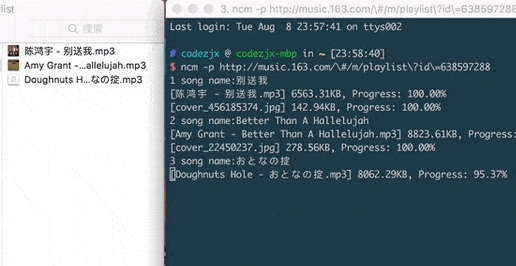

# 网易云音乐下载器
基于Python3.X编写的网易云音乐命令行下载器，自动下载专辑封面，记录歌手名、音乐标题、专辑名等元数据，并写入[ID3 Tags][1] metadata容器。在github上试了几个高星的下载器都没有写入专辑封面，对于强迫症患者简直不能忍，于是一怒之下决定自己写。

## Preview


## Installation

若没有安装Python3，请先到官网下载并安装：
> https://www.python.org/download/releases/3.0/


首先下载源码：
```bash
$ git clone https://github.com/codezjx/netease-cloud-music-dl.git
```

进入根目录，然后执行：
```bash
$ python setup.py install
```

最终显示以下log，表示顺利安装：
```
running install
running bdist_egg
running egg_info
...
...
Finished processing dependencies for netease-cloud-music-dl==x.x.x
```

后续直接在命令行中通过`ncm`指令即可快速调用相关功能，**Warning: 目前只支持Python3.x版本**

## Feature
- 支持下载专辑封面并嵌入MP3文件
- 支持写入歌手名、音乐标题、专辑名等信息至[ID3 Tags][1]
- 支持跳过已下载的音频文件
- 支持常见设置选项，如：保存路径、音乐命名格式、文件智能分类等
- 默认下载比特率为320k的高品质音乐（若木有320k则会自动下载最高比特率）
- 支持下载单首/多首歌曲
- 支持下载歌手热门单曲（可配置最大下载数）
- 支持下载专辑所有歌曲
- 支持下载公开歌单所有歌曲

**（注意：已下架的音乐暂时无法下载）**

通过`ncm -h`即可查看所支持的参数列表：
```
$ ncm -h
usage: ncm [-h] [-s song_id] [-ss song_ids [song_ids ...]] [-hot artist_id]
           [-a album_id] [-p playlist_id]

optional arguments:
  -h, --help            show this help message and exit
  -s song_id            Download a song by song_id
  -ss song_ids [song_ids ...]
                        Download a song list, song_id split by space
  -hot artist_id        Download an artist hot 50 songs by artist_id
  -a album_id           Download an album all songs by album_id
  -p playlist_id        Download a playlist all songs by playlist_id
```

## Usage

### 下载单曲

使用参数`-s`，后加歌曲id或者歌曲完整url，如：
```bash
$ ncm -s 123123
or
$ ncm -s http://music.163.com/#/song?id=123123
```

### 下载多首歌曲

使用参数`-ss`，后加歌曲ids或者歌曲完整urls(id或url之间通过空格隔开)，如：
```bash
$ ncm -ss 123123 456456 789789
or
$ ncm -ss url1 url2 url3
```

### 下载某歌手的热门单曲(默认下50首，可配置)

使用参数`-hot`，后加歌手id或者完整url，如：
```bash
$ ncm -hot 123123
or
$ ncm -hot http://music.163.com/#/artist?id=123123
```

### 下载某张专辑的所有歌曲

使用参数`-a`，后加专辑id或者完整url，使用方法同上。

### 下载某个公开的歌单

使用参数`-p`，后加歌单id或者完整url，使用方法同上，必须确认是**公开**的歌单才能下载哦。

## Settings

配置文件在在用户目录下自动生成，路径如下：
```
/Users/yourUserName/.ncm/ncm.ini
```

目前支持以下几项设置：
```
[settings]

#--------------------------------------
# 热门音乐的最大下载数，默认50
# Range: 0 < hot_max <= 50
#--------------------------------------
download.hot_max = 50

#--------------------------------------
# 音乐文件的下载路径，默认在用户目录.ncm/download目录下
#--------------------------------------
download.dir = /Users/yourUserName/.ncm/download

#--------------------------------------
# 音乐命名格式，默认1
# 1: 歌曲名
# 2: 歌手 - 歌曲名
# 3: 歌曲名 - 歌手
#--------------------------------------
song.name_type = 1

#--------------------------------------
# 文件智能分类，默认1
# 1: 不分文件夹
# 2: 按歌手分文件夹
# 3: 按歌手/专辑分文件夹
#--------------------------------------
song.folder_type = 1
```

**Warning:** 智能分类设置目前只针对`-s`和`-ss`参数有效，`-hot/-a/-p`分别会存于后缀为：`-hot50/-album/-playlist`的文件夹中，方便管理本地音乐。

## Feedback

如果遇到Bugs，欢迎提issue或者PR，谢谢各位支持~

## License

MIT License

Copyright (c) 2017 codezjx <code.zjx@gmail.com>

Permission is hereby granted, free of charge, to any person obtaining a copy
of this software and associated documentation files (the "Software"), to deal
in the Software without restriction, including without limitation the rights
to use, copy, modify, merge, publish, distribute, sublicense, and/or sell
copies of the Software, and to permit persons to whom the Software is
furnished to do so, subject to the following conditions:

The above copyright notice and this permission notice shall be included in all
copies or substantial portions of the Software.

THE SOFTWARE IS PROVIDED "AS IS", WITHOUT WARRANTY OF ANY KIND, EXPRESS OR
IMPLIED, INCLUDING BUT NOT LIMITED TO THE WARRANTIES OF MERCHANTABILITY,
FITNESS FOR A PARTICULAR PURPOSE AND NONINFRINGEMENT. IN NO EVENT SHALL THE
AUTHORS OR COPYRIGHT HOLDERS BE LIABLE FOR ANY CLAIM, DAMAGES OR OTHER
LIABILITY, WHETHER IN AN ACTION OF CONTRACT, TORT OR OTHERWISE, ARISING FROM,
OUT OF OR IN CONNECTION WITH THE SOFTWARE OR THE USE OR OTHER DEALINGS IN THE
SOFTWARE.

[1]: https://zh.wikipedia.org/wiki/ID3